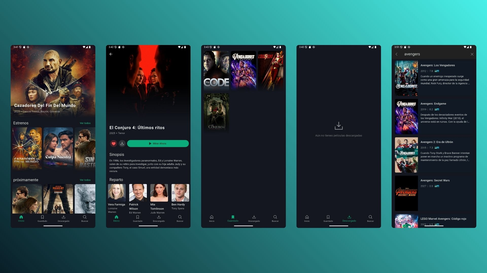

# 🎬 Trivvo

**Trivvo** es una app Flutter que funciona como una enciclopedia interactiva de películas, series, actores y más. Utiliza la API oficial de [TMDB](https://www.themoviedb.org/) para ofrecer información actualizada del mundo audiovisual.



---

## 🚀 Comenzando

Sigue estos pasos para ejecutar Trivvo en tu entorno local:

### 1. Clonar el repositorio

```bash
git clone https://github.com/tu-usuario/trivvo.git
cd trivvo
```

### 2. Configurar variables de entorno

Este proyecto utiliza un archivo `.env` para gestionar el token de acceso a la API de TMDB.

```bash
cp .env.template .env
```

Edita el archivo `.env` y reemplaza el valor con tu token de acceso:

```env
TMDB_API_Read_Access_Token=tu_access_token_aquí
```

> Puedes obtener tu token registrándote en [TMDB](https://www.themoviedb.org/settings/api).

### 3. Instalar dependencias

```bash
flutter pub get
```

### 4. Generar el código de Riverpod

Este proyecto utiliza generación de código con Riverpod, por lo que es necesario ejecutar:

```bash
dart run build_runner watch -d
```

> Este paso permite compilar correctamente los providers anotados con `@riverpod`.

### 5. Ejecutar la app

```bash
flutter run
```
